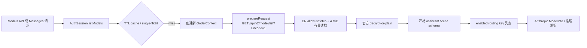
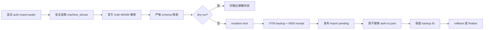

# 架构说明

## 设计取舍

项目已从早期 Gate 1 walking skeleton 演进为多模块实现：HTTP 编排保留在 `src/proxy.ts`，模型目录位于 `src/models.ts`，Auth WASM、凭据与会话位于 `src/auth/`，转换与 SSE 也各自独立。历史“单文件实现”描述仅适用于早期基线，不再描述当前源码结构。

## 模块划分

1. **模型目录领域层** —— `src/models.ts` 严格解析官方 `assistant` scene，完成精确 lookup、Anthropic `ModelInfo` 映射和 cursor 分页
2. **官方 Auth WASM 运行时加载** —— 定位 `qoderclicn` 二进制 → 提取内嵌 WASM 模块 → 手写 wasm-bindgen glue → 暴露通用 `prepareRequest` 与推理 `prepareInferRequest`
3. **安全 config store 与 AuthSession** —— 凭据加载 / 保存 / 删除、刷新 single-flight、官方模型目录 single-flight/TTL
4. **Anthropic Messages → CN legacy body 转换器** —— 使用已验证目录条目生成 `model_config`
5. **CN legacy SSE 解析** —— 双信封解包 + tool_call 增量聚合
6. **Anthropic SSE 发射器** —— CN legacy chunk → Anthropic 事件流
7. **Hono 应用与路由** —— `/v1/models`、模型 retrieve、Messages 路由

## 模型目录与路由一致性

代理通过官方 Auth WASM 的通用签名入口调用 `GET /api/v2/model/list?Encode=1`，只遍历根对象的 `assistant` 数组，忽略整个独立 `byok_enterprise` scene，并额外过滤 `assistant` 内显式标记 `server_scene === "byok_enterprise"` 的条目；不会按 `source` 或 `provider` 猜测 BYOK。生产缓存是脱敏、不可变的内存 snapshot，默认 TTL 100 秒，并用 Promise single-flight 合并并发刷新；过期刷新失败直接返回 502，不无限使用 stale 目录。

每个 snapshot 都带单调递增 generation。Messages 的模型解析、CN body 转换和 `prepareInferRequest` 签名必须使用同一 generation；凭据或目录刷新使旧 generation 立即失效。若解析与签名间发生更新，代理会重新读取目录并重新解析，避免 entitlement 变化导致 TOCTOU。

## 数据流

## 官方模型目录流

目录响应、签名 headers 与完整解密内容不进入客户端响应或常规日志。目录 401 只通过现有 refresh single-flight 重试一次；刷新后目录 generation/cache 立即失效，以观察账号 entitlement 变化。

## WASM Auth Bridge

- **二进制定位**：`QODERICN_BIN` 环境变量 → `PATH` 搜索 `qoderclicn` → `$HOME/.local/bin/qoderclicn`（详见 `docs/CONFIG.md`）。找不到时直接抛错，不做静默降级。
- **模块提取**：`extractWasmModules` 在二进制中扫描 WASM magic header（`\0asm`），并额外探测 base64 内嵌的 WASM —— 真实 `qoderclicn` 采用 base64 编码内嵌方式打包 Auth 模块。
- **角色匹配**：每个候选模块的导出函数名通过 `EXPORT_MATCHERS` 正则匹配到功能角色（`malloc`/`free`/`generateRuntimeAuthFields`/`qodercontextNew`/`qodercontextPrepareRequest` 等），`selectAuthModule` 选择完整具备 `REQUIRED_ROLES` 全部角色的模块；找不到满足条件的模块则抛错（fail-closed，不会退化使用不完整的模块）。
- **glue 层**：`createBridge` 手写了最小 wasm-bindgen 兼容层（堆对象表、字符串编解码、栈指针操作、import handler 解析），迁移自 Gate 0 PoC 已验证的 import 解析语义。未识别的 import **不做 shim**，同样是 fail-closed。

## Qoder 凭据导入数据流

导入与凭据 rotation 共用跨进程 mutation lock，并在 mutation 前拒绝 rotation evidence。`load()` 会在使用凭据前收敛未完成 import：旧目标撤销 pending/孤立备份，新目标确认提交；无法证明 generation/hash 的状态保持 fail-closed。rollback/finalize 在发布 cleanup intent 后重新核对目标 inode 与内容 hash，才允许覆盖或删除证据。

已提交但尚未 finalize 的 backup 是受支持状态：`auth import-status` 只返回脱敏 UUID/状态，用于 stdout 中断或进程崩溃后的句柄恢复；此时 `load()` 仍可读取已提交凭据，但 rotation、普通 save 和 delete 均保持互斥，直到显式 rollback/finalize。

## 凭据与签名调用顺序

`buildSignedInferRequest` 按以下顺序驱动 WASM：

1. `fetchOpenApiUserInfo`：用已存储 token 调用 CN OpenAPI `/api/v1/userinfo`
2. `generateRuntimeAuthFields`：用 userinfo 生成运行时鉴权字段
3. `QoderContext.create`：以 machineId / cosyVersion / userInfo / clientContext 构造上下文
4. `context.prepareInferRequest`：产出实际请求的 `url` / `body`（`headers` 访问器存在但当前未被调用，见 `docs/SECURITY.md` 待验证条目）

## 参考仓库（只读，不改）

CLAUDE.md 中提到以下只读参考，用于工程形态 / 协议健壮性对照：

- `codemaker-proxy` —— Hono 服务、CLI 生命周期、并行工具索引 Map 的工程参考
- `codex-proxy` —— SSE frame parser、tool 状态机、Anthropic block 生命周期的协议参考
- `experiments/qoder-cn-auth-bridge-poc.ts` —— Gate 0 已验证 PoC，本仓库的 WASM 加载 / 签名逻辑由此迁移而来

**待验证**：以上三个路径均不在本项目目录树内，属于仓库外部或团队本地路径。遵循项目「代码 / 配置 / 文档中禁止写入绝对路径」的规范，本文档不给出具体路径；如需查阅，请向实现负责人确认当前位置。
